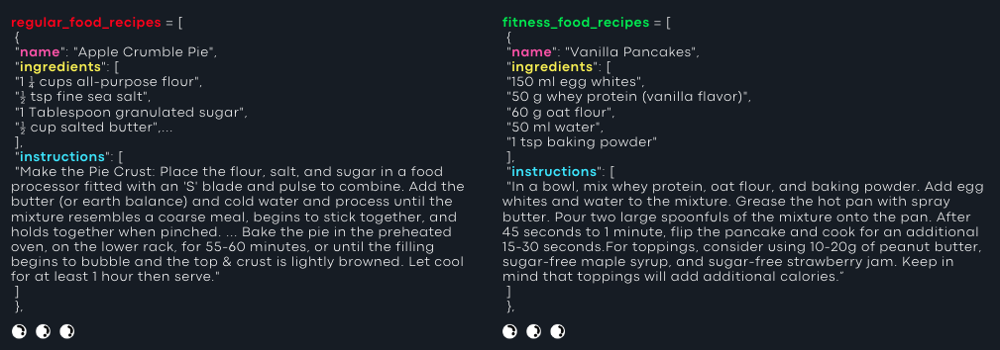
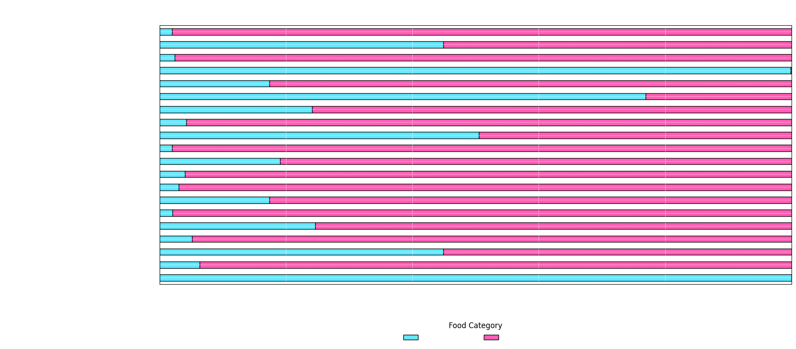

#### 2024_ia653 
## NLP Project: Tea Farkas & Lovro Banovic

MEETING 1 - 11/12/2024 - 1pm
 
#### PROJECT PROCESS:
**step 1:** Prepare the data by extracting recipes from cookbooks and saving them in a format suitable for the development of models. 
**step 2:** Determining the appropriate models for this data set and identifying those that will yield the most accurate predictions. 
**step 3:** Prepare the data for a specific model, construct the model, and assess its performance. 
**step 4:** In analyzing the results, the focus will be on graphing the data. The objective is to implement the most effective model within the Flask application. 
 

#### ABOUT THE DATA
Our data is gathered from several sources, primarily including a cookbook developed by Tea, a member of our team, which will provide a significant portion of our fitness recipe data. Additionally, we reference three websites: https://joyfoodsunshine.com/, https://www.delish.com/cooking/, and https://www.allrecipes.com/, which serve as our sources for both regular and fitness recipes. This diverse approach will enhance the versatility of our model. Our goal is to ensure that it can effectively process new and unseen data to the greatest extent possible.
 

We are organizing our data by compiling all regular recipes into a single list of dictionaries, referred to as *regular_food_recipes*, while all fitness recipes are collected in *fitness_food_recipes*. Subsequently, we will label these entries and merge them for classification purposes. Our goal is to be able to classify new recipes as either regular or fitness recipes.

### SIMPLE APPROACH: NAIVE BAYES MODEL
The Naive Bayes model is highly effective for text classification tasks.

**WHY?**
- Naive Bayes requires relatively small amounts of training data and is renowned for its simplicity, speed, and efficiency.

**WHY NOT?**
- The model's assumption of independence among features often does not hold true in real-world data. For example, in natural language processing tasks, certain words frequently appear together (such as "dark chocolate" or "zero sugar"), which poses a challenge for models that regard these occurrences as independent events.
 

### SIMPLE APPROACH: MULTINOMIAL NAIVE BAYES

The Multinomial Naive Bayes (MultinomialNB) classifier is particularly effective for text classification tasks.

**WHY?**  
This methodology excels with datasets that are represented by word frequencies, making it ideal for classifying recipes based on their ingredient lists, which have been transformed into TF-IDF (Term Frequency-Inverse Document Frequency) vectors. This approach allows the model to accurately reflect the importance of terms within the recipes, thereby aiding in the identification of patterns that distinguish "fitness" recipes from "regular" ones.

**WHY NOT?**  
However, the model may encounter challenges related to misclassification, especially when "fitness" and "regular" recipes share overlapping ingredients.
 
 
The classifier demonstrates an accuracy of 84%, exhibiting high precision for Fitness at 1.00, though it has a lower recall of 0.70. This indicates that some fitness recipes are being misclassified as regular. In contrast, for Regular, the precision stands at 0.75 with a perfect recall of 1.00. This means that all regular predictions are accurate, but there is still the possibility of misclassifying certain fitness recipes.
 

### COMPLEX MODEL ...
...brainstorming...

1. Recipe Classification Model  
Use a BERT-based model like DistilBERT or RoBERTa to classify recipes as "regular" or "fitness" based on context.  
2. Token Classification 
Implement a fine-tuned BERT-based model for token classification to identify key components like ingredients and cooking methods that differentiate recipe categories.  
3. Model Interpretation 
Utilize SHAP and LIME to understand model decisions. For example, SHAP may highlight that ingredients like sugar and butter contributed to labeling a recipe as "regular."  
4. Healthier Alternatives 
Use a template generator to suggest healthier substitutions, such as replacing "butter" with "avocado" or "sugar" with "stevia." A dictionary of fitness substitutions can enhance these recommendations.

Replacement Template: "Swap [flagged_ingredient] for a healthier option like [fitness_alternative]."

### FUTURE WORK  
In forthcoming developments, we will integrate the most effective model into the existing Flask application. This enhancement will enable users to input their meals and ascertain whether they align with fitness criteria, as well as provide guidance on how to convert them into fitness-oriented recipes.
 

**Questions to ask the professor:**
- Is this a good path to follow in building our complex model? 
- Should we focus on another approach or different ways to achieve the results we want?

The adventure is just beginning... stay tuned for what's next!