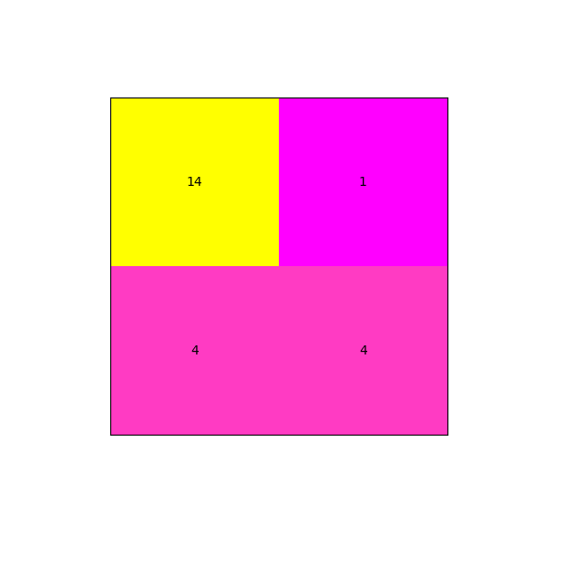
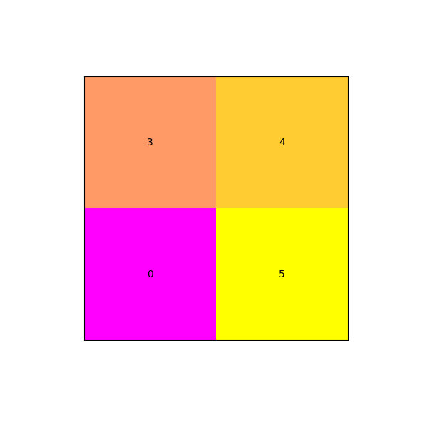
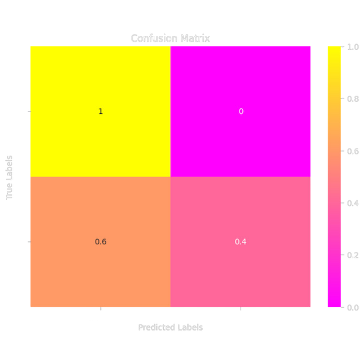

## Natural Language Processing Project: Recipe classification
#### Group members: Tea Farkas & Lovro Marko Banovic
##### Date: December 2024

### About the dataset
In this class, we explored various methods for processing different types of texts. This led us to consider the exciting possibility of inputting a recipe and receiving feedback on whether it is fitness-friendly. Moreover, we could offer users suggestions on how to modify less healthy recipes to make them more nutritious. This approach could assist individuals in improving their eating habits and demonstrate how small changes can enhance their meals and contribute to healthier lifestyles.

To achieve this, we needed to find a good dataset that included a fair ratio of regular and fitness recipes. We faced many challenges due to the overwhelming misinformation on the internet regarding fitness recipes. It's common to find recipes labeled as "fitness" that are actually high in sugar, which doesn't make sense. Therefore, we had to be extra careful in ensuring our dataset contained genuine fitness recipes. 

To build a reliable model, we gathered 56 regular recipes and 56 fitness recipes to maintain a balanced dataset. We saved these in two separate text files—one for regular recipes and another for fitness recipes. This organization streamlined the labeling process; we simply imported both files, reviewed the recipes individually, and applied the appropriate labels. Afterward, we merged these labeled dataframes into one and exported the final dataframe as a CSV file, making our data ready for training different models.

Our data was collected from various sources, primarily from a cookbook developed by Tea, a member of our team, which contributed a significant portion of the fitness recipe data. We also consulted three websites: https://joyfoodsunshine.com/, https://www.delish.com/cooking/, and https://www.allrecipes.com/, which provided us with additional regular and fitness recipes. This diverse approach enhances the versatility of our model. Diversity is particularly evident in the ingredient measurements, as some recipes use metric units while others use the imperial system. All recipes are written in English.
This is small sample of our data:

| title              | ingredients | instructions | label |
| :---------------- | :------: | :----: | ----:|
| Chicken nuggets        |   450g of 93% lean ground chicken 15g parmesan cheese 2 eggs 40g spelt flour 400g potato 15g light cream cheese 1 zucchini, 2 tomato 1 pepper, 1/2 an onion salt, garlic, red pepper | Mix ground chicken, egg, Parmesan cheese, salt, and sweet pepper in a bowl. Form small nuggets with your hands and place them on a baking sheet lined with parchment paper. Put the sheet in the freezer for 20 minutes.Preheat the oven to 425 degrees. Beat an egg in one bowl and mix spelt flour, red pepper, salt, and garlic powder in another bowl. Place new parchment paper on a baking pan. Dip the nuggets on both sides in the beaten egg, then in the spelt flour, and place them on the new parchment paper. Spray the nuggets with cooking oil before baking. After 10 minutes of baking, remove the pan from the oven, spray the nuggets with oil again, and return them to bake for another 15 minutes. Peel the potatoes and boil them in cold water for 40 minutes. Once the potatoes are cooked, add light spread cream cheese and a little salt. Mix with a mixer until creamy. Cut the zucchini, pepper, onion, and tomato. Spray a pot with cooking oil and heat it up. Add the vegetables and a little salt, cover, and let them cook for 20 minutes. | **fintess** |
| Chicken Nuggets        |   vegetable oil for frying 4 cups all-purpose flour 6 tablespoons garlic salt 3 tablespoons ground black pepper 4 large eggs, beaten 8 skinless, boneless chicken breast halves - cut into small chunks | Gather all ingredients. Heat 1 inch oil in a large skillet or saucepan to 350 degrees F (175 degrees C). Stir together flour, garlic salt, and pepper in a bowl. Dip chicken pieces into beaten eggs, then press each piece into flour mixture to coat well; shake off excess flour. Place coated chicken pieces onto a plate. Working in batches, fry chicken in hot oil until golden brown and no longer pink in the center. An instant-read thermometer inserted into the center should read at least 165 degrees F (74 degrees C). | **regular** |

This small sample of our dataset clearly demonstrates our effort to include similar recipes in both the fitness and regular versions, which aids the model in learning the distinctions between them. In this instance, the notable difference lies in the method of meal preparation: 'frying' is utilized in regular recipes, while 'baking' is employed in fitness recipes.

### The Goal
The primary objective of developing a model to classify recipes is to integrate it into a fitness app. This app will evaluate your recipes, determine their suitability for your diet based on your specific goals, and create a personalized meal plan for you.


### Process overview
The first challenge we encountered after collecting the data was preprocessing it. We needed to determine an effective method for preparing our dataset for model training. Given that we had numerous numerical values embedded within the ingredient text, we devised a function to extract these values, another to convert fractions to floats, and a third to normalize the units. This process was applied to each individual ingredient, resulting in a large dataset with a considerable number of features. However, when we attempted to build the model using this data, we found that the accuracy was quite low. 

Subsequently, we decided to simplify our approach by extracting the ingredient amounts per recipe and summing them to create a single value, which we referred to as `ingredient_quantity`. The revised dataset includes columns for the recipe title, ingredients, instructions, and ingredient quantity. Additionally, we utilized a `clean_text` function to refine our text by replacing newlines with spaces, removing non-alphanumeric characters (excluding spaces), and converting everything to lowercase. After cleaning the data, we merged all text inputs, combining the ingredients, instructions, and ingredient quantities to serve as a single input variable.

The second challenge was identifying a suitable model for our dataset. We initially planned to use DistilBERT, but this model yielded unsatisfactory accuracy. Consequently, we needed to explore alternative options and analyze why we were experiencing low accuracy with this particular model.

### EDA/Preprocessing steps taken
The dataset consists of columns for ingredients, instructions, and ingredient quantities, which we combine to feed into the model. The output variable is the label, and the ingredient quantities are specifically utilized with the Naive Bayes model. We employed these variables to construct a classification model aimed at classifying based on the 'label' column. Our dataset comprises 112 rows and 5 columns, with each row representing a single recipe that includes attributes such as title, ingredients, instructions, ingredient quantities, and labels. Importantly, our dataset is free from missing values, as we created it with complete control over this aspect. Additionally, we ensured that the dataset is well-balanced, which is clearly illustrated in *Graph 1 - Class Distribution* below.


*Graph 1 - Class Distribution*

In the development of the DistilBERT model, we utilized pre-trained embeddings from the `distilbert-base-uncased` variant. For the Albert model, the pre-trained embeddings employed were from the `albert-base-v2` variant.
To partition our dataset, we applied a test size of 0.2. Given the relatively limited size of our dataset, this ratio is deemed appropriate for effectively training and evaluating our models.


### Model 1 - Multionomila Naive Bayes
The initial model we examined during the first part of the semester was the Multinomial Naive Bayes classifier, which achieved an impressive accuracy of 0.7826—a commendable result for such a straightforward language model. The Multinomial Naive Bayes (MultinomialNB) classifier performed effectively in our recipe classification task. The results were satisfactory considering the dataset size, demonstrating that this simple model can attain noteworthy accuracy. We explored two different methods of data preprocessing; notably, the second approach, which involved summing ingredient amounts, resulted in an improvement in accuracy from 0.70 to 0.78. It is possible that the first method may yield better performance with a larger dataset of 10,000 recipes or more, as it would likely enhance the identification of common ingredients. In our specific case, utilizing a simple summation of ingredient quantities proved to be a valuable feature for the development of this model.


|                | precision | recall | f1-score | support |
| :---------------- | :------: | :----: | :----: | :----: |
| regular       |   0.78   | 0.93 | 0.85 | 15 |
| fitness       |   0.80   | 0.50 | 0.62 | 8 |
| accuracy       |      |   | 0.78 | 23 |
| macro avg       |  0.79 | 0.72  | 0.73 | 23 |
| weighted avg       |  0.79 | 0.78  | 0.77 | 23 |



*Graph 2 - Confusion Matrix MultinomialNB*

The model occasionally misclassifies regular recipes as fitness recipes due to certain key ingredients, such as chicken and vegetables, which are prevalent in both categories. It seems to overlook the amount of oil or additional sauces that may contain sugar, leading to an incorrect classification. Therefore, these recipes should be categorized as regular recipes based on these specific details.


### Model 2 - DistilBERT model
The second model we tested was DistilBERT, which yielded a relatively low accuracy of 0.58. DistilBERT is a streamlined version of BERT that retains 97% of its language comprehension but operates with fewer layers, making it more efficient. However, when applied to smaller datasets like ours, DistilBERT may struggle to identify significant patterns effectively. While it offers speed, it can sometimes miss the deeper nuances of language. Although it tends to focus on key phrases, it may overlook the finer details that are crucial for distinguishing between regular and fitness recipes.

We set up the model for binary classification ("regular" vs. "fitness") using the “distilbert-base-uncased” version. The training uses a batch size of 16 and PyTorch’s DataLoader for handling data. We use the AdamW optimizer with a learning rate of 5×10⁻⁵, effective for transformers, along with a linear learning rate scheduler that gradually lowers the rate during training.
The model trains for 3 epochs, using a GPU if available. We monitor loss and accuracy, using cross-entropy loss and making predictions by selecting the class with the highest logit score. Regularization and dropout layers help prevent overfitting. After training, we summarize performance with precision, recall, and F1-score for both classes.


|                | precision | recall | f1-score | support |
| :---------------- | :------: | :----: | :----: | :----: |
| regular       |   0.75   | 0.43 | 0.55 | 7 |
| fitness       |   0.41   | 1.00 | 0.58 | 5 |
| accuracy       |      |   | 0.58 | 12 |
| macro avg       |  0.62 | 0.61  | 0.58 | 12 |
| weighted avg       |  0.65 | 0.58  | 0.57 | 12 |


*Graph 3 - Confusion Matrix DistilBERT*

A model struggles significantly when tasked with classifying fitness recipes. It faces considerable challenges in distinguishing between regular recipes and fitness-oriented ones. This confusion likely stems from the limitations of DistilBERT models in capturing the subtle details that are essential for making this classification. These details often include minor variations in the cooking methods or slight differences in ingredients, such as using sugar versus stevia.


### Model 3 - Albert model
The third model we tested, ALBERT, yielded an impressive accuracy of 0.67. This model offers a more efficient alternative to BERT through two key features: Shared Parameters and Task Complexity. By sharing parameters across layers, ALBERT reduces its overall size while maintaining performance. This strategy enables ALBERT to achieve superior language representations with fewer parameters compared to DistilBERT. Consequently, ALBERT is generally more adept at identifying intricate details in language than DistilBERT. Its efficiency makes it particularly effective for understanding complex language, making it an excellent choice for datasets that require nuanced interpretation of context and relationships.

The model uses the "albert-base-v2" version of the ALBERT architecture, which is a smaller, more efficient type of BERT for natural language processing (NLP) tasks. ALBERT, or "A Lite BERT," reduces model size by sharing parameters across layers, leading to faster processing and improved memory use.
This model is fine-tuned for binary classification, with two output neurons representing classes like "regular" and "fitness." We train it using PyTorch on a GPU or CPU, processing data in batches of 16 with the DataLoader. The AdamW optimizer is set at a learning rate of 5×10⁻⁵.
Training includes a learning rate scheduler that adjusts the rate over three epochs, starting with zero warmup steps. The model's performance is evaluated on both training and validation datasets, monitoring loss and accuracy throughout. 


|                | precision | recall | f1-score | support |
| :---------------- | :------: | :----: | :----: | :----: |
| regular       |   1.00   | 0.43 | 0.60 | 7 |
| fitness       |   0.56   | 1.00 | 0.71 | 5 |
| accuracy       |      |   | 0.67 | 12 |
| macro avg       |  0.78 | 0.71  | 0.66 | 12 |
| weighted avg       |  0.81 | 0.67  | 0.65 | 12 |



*Graph 4 - Confusion Matrix Albert*

This model struggles with classifying fitness recipes but ultimately outperforms the DistilBERT model. It's also more effective to categorize certain fitness recipes as regular ones rather than misclassifying regular recipes as fitness-oriented. Overall, we are not fully satisfied with the performance of this model.


### Model 4 - Neuarl Network model
The fourth model we explored was a Neural Network, which achieved the highest accuracy of 0.75. This model is particularly effective with structured, numerical data typically organized in tables. When the features are well-defined and the data is properly prepared, it can learn efficiently. For small, well-structured datasets like ours, a basic neural network can learn and generalize effectively. Its fewer parameters and lower computational demands help minimize the risk of overfitting. For straightforward relationships within the data, a simple feedforward neural network can perform reliably. However, to attain that level of accuracy, we needed to experiment with various hyperparameters, the number of layers, and implement techniques like early stopping, among other adjustments.

This model is a fully connected feedforward neural network (FNN) designed specifically for classification tasks. It employs a straightforward architecture with dropout-based regularization and does not incorporate weight penalization. To optimize training efficiency and avoid unnecessary computations, the EarlyStopping callback is utilized effectively.

The model has two hidden layers. The first hidden layer contains 128 neurons and uses the ReLU activation function, which helps the model learn non-linear relationships. After this layer, there is a dropout layer set to 0.5, meaning it disables 50% of the neurons during training to help prevent overfitting. The second hidden layer has 64 neurons, also using ReLU activation, and follows with another dropout layer at the same rate of 0.5. 

The output layer has 2 neurons for binary classification and uses the softmax activation function to turn outputs into probabilities for each class. The model uses the sparse_categorical_crossentropy loss function, which is suitable for multi-class classification with integer labels. For optimization, it uses the Adam optimizer, which adjusts the learning rate to speed up training. We measure performance using accuracy as the evaluation metric.

Both dropout layers are set to 0.5 to ensure strong regularization by randomly turning off half of the neurons during training. EarlyStopping is used as a callback to keep an eye on validation loss (val_loss). If the validation loss does not improve for 5 epochs in a row, training stops early, and the model will use the best weights from the epoch with the lowest validation loss.

The model trains on train_dataset_vectorized and validates on valid_dataset_vectorized. Training is set for a maximum of 50 epochs, but EarlyStopping may end it sooner if the validation loss levels off.


```{python}
early_stopping = EarlyStopping(monitor='val_loss', patience=5, restore_best_weights=True)

model = tf.keras.Sequential([
    layers.InputLayer(input_shape=(8660,)),
    layers.Dense(128, activation='relu'),
    layers.Dropout(0.5),
    layers.Dense(64, activation='relu'),
    layers.Dropout(0.5),
    layers.Dense(2, activation='softmax')
])
```

Using the same model without early stopping, we achieved the same accuracy but completed 50 epochs. In contrast, with early stopping, we reached that high accuracy in just 6 epochs.


|                | precision | recall | f1-score | support |
| :---------------- | :------: | :----: | :----: | :----: |
| regular       |   0.70   | 1.00 | 0.82 | 7 |
| fitness       |   1.00   | 0.40 | 0.57 | 5 |
| accuracy       |      |   | 0.75 | 12 |
| macro avg       |  0.85 | 0.70  | 0.70 | 12 |
| weighted avg       |  0.82 | 0.75  | 0.72 | 12 |



*Graph 5 - Confusion Matrix Neuarl network*
 
### Overfitting/Underitting

**Multinomial Naive Bayes**
We aimed to identify overfitting and underfitting by calculating training and validation accuracy, comparing the differences between them.
Training accuracy of 0.58 and validation accuracy of 0.78 indicate that the model is not overfitted.


**DistilBERT**

Both the training and validation losses decrease at first. However, after a few epochs, the validation loss starts to increase while the training loss keeps going down. 
This graph shows that the model is overfitting. At first, the model learns well, and both losses decline. But over time, it starts to memorize the training data, which causes a gap between the two losses.


*Graph 6 - DistilBERT Training and Validation Loss Graph*


**Albert**


*Graph 7 - Albert Training and Validation Loss Graph*

The training loss goes down significantly over the epochs, showing that the model is learning from the training data. However, the validation loss goes down at first but starts to rise after epoch 2. This indicates a gap between how well the model performs on training data versus validation data.
The model shows signs of overfitting starting around epoch 2. It keeps getting better on the training data but performs worse on the validation data, as shown by the increasing validation loss. Overfitting happens when the model memorizes the training data instead of learning from it, which leads to poor performance on new data. There is no sign of underfitting because the steady drop in training loss means the model is learning well during training.


**Neural Network**

**Accuracy Comparison**

Before L2 Regularization:
Training Accuracy: Increased quickly, reaching high values (about 0.9).  
Validation Accuracy: Reached its highest point early (around epochs 3-4) and then dropped sharply, showing a big gap between training and validation performance.  
The model performs well on the training data but does not generalize well to validation data, indicating overfitting.  

After L2 Regularization:  
Training Accuracy: Keeps increasing and also reaches high values (around 0.9), but the increase is a bit slower than before. This means regularization helps the model avoid just memorizing the training data.  
-Validation Accuracy: Still peaks early and starts to drop after epoch 4, but the drop is less sharp than in the earlier case. The validation accuracy stays slightly higher for a longer time.  
There is a slight improvement in the overfitting problem, as the validation accuracy declines more slowly.


| Before L2 Regularization    | After L2 Regularization |
| :--------: | :-------: |
|   |     |


**Loss Comparison**

Before L2 Regularization:
Training Loss: The training loss steadily decreased and reached very low values.
Validation Loss: The validation loss decreased at first but started to increase significantly after 3-4 epochs, showing signs of overfitting.
There was a clear difference between training and validation loss.

After L2 Regularization:
Training Loss: The training loss continued to decrease steadily but at a slightly slower pace because of the L2 penalty. The loss did not reach the low levels observed earlier since regularization helps avoid overly complex weights.
Validation Loss: The validation loss still increased after epoch 4, but the rise was less noticeable than before. The validation loss remained more stable over additional epochs.
There was a clear reduction in overfitting, as the gap between training and validation loss was smaller.


| Before L2 Regularization    | After L2 Regularization |
| :--------: | :-------: |
|   |     |


### Examples of Naive Bayes Predictions - NEW

```{python}
recipe_text_example1 = "1 ½ cups all-purpose flour, 1 teaspoon baking powder, ½ teaspoon baking soda, ¼ teaspoon salt, ¾ cup granulated sugar, ½ cup unsalted butter, 2 large eggs, 1 teaspoon vanilla extract, ½ cup whole milk, ½ cup semi-sweet chocolate chips."
update_feedback(recipe_text_example1)
```
*output:*

❌ This is not a fitness recipe!
This meal might not be the best option for your fitness goals, but don’t worry! Here are some friendly tips to make it a bit healthier:
Try swapping sugar for a tasty and healthier option like stevia or honey. You'll love the change!
Try swapping butter for a tasty and healthier option like coconut oil. You'll love the change!


```{python}
recipe_text_example2 = "For a hearty spaghetti bolognese, start by heating olive oil in a large pan over medium heat. Add 1 diced onion, 2 minced garlic cloves, and 1 grated carrot, cooking until softened. Add 500g ground beef, cooking until browned. Stir in 1 can of crushed tomatoes, 2 tablespoons tomato paste, 1 teaspoon dried oregano, and 1 teaspoon dried basil. Simmer for 20 minutes, seasoning with salt and pepper to taste. Serve over cooked spaghetti, garnished with grated Parmesan and fresh parsley."
update_feedback(recipe_text_example2)
```
*output:*

✅ This is a fitness recipe! This meal is perfect for staying fit and healthy!


### Examples of Naive Bayes Predictions - FROM OUR DATA

```{python}
dataset_recipe1='''vegetable oil for frying
4 cups all-purpose flour
6 tablespoons garlic salt
3 tablespoons ground black pepper
4 large eggs, beaten
8 skinless, boneless chicken breast halves - cut into small chunks.'''

update_feedback(dataset_recipe1)
```
*output:*

❌ This is not a fitness recipe!
This meal might not be the best option for your fitness goals, but don’t worry! Here are some friendly tips to make it a bit healthier:
How about trying a healthier option instead of frying, like baking or grilling? It’s a great way to enjoy your meals while making them even better for you!


```{python}
dataset_recipe2='''4 cups water
2 cups uncooked white rice
3 tablespoons soy sauce
2 tablespoons creamy peanut butter
2 teaspoons white wine vinegar
¼ teaspoon cayenne pepper
3 tablespoons olive oil
4 skinless, boneless chicken breast halves - cut into thin strips
3 tablespoons chopped garlic
1 ½ tablespoons chopped fresh ginger root
2 ½ cups broccoli florets
¾ cup chopped green onions
⅓ cup unsalted dry-roasted peanuts
Combine water and rice in a saucepan over medium-high heat; bring to a boil. Reduce heat to low, cover, and simmer until rice is tender and liquid is absorbed, about 20 minutes.
Meanwhile, stir together soy sauce, peanut butter, vinegar, and cayenne pepper in a small bowl; set aside.
Heat olive oil in a skillet or wok over high heat. Cook and stir chicken, garlic, and ginger in hot oil until chicken is lightly browned, about 5 minutes. Reduce heat to medium and add broccoli, green onions, peanuts, and soy sauce mixture. Cook, stirring frequently, until broccoli is tender and chicken is cooked through, about 5 minutes.
Serve chicken-broccoli mixture over cooked rice.'''

update_feedback(dataset_recipe2)
```
*output:*

✅ This is a fitness recipe! This meal is perfect for staying fit and healthy!


```{python}
dataset_recipe3='''40g Oats
30g Vanilla Whey protein
5g cacao powder
50g banana
15g Hershey Zero Sugar
Chocolate Baking Chips'''

update_feedback(dataset_recipe3)
```
*output:*

✅ This is a fitness recipe! This meal is perfect for staying fit and healthy!


### Examples of Predictions Made by a Neural Network Model - NEW

```{python}
recipe_text_example1 = '''1 (4 pound) chicken, cut into pieces
1 cup buttermilk
2 cups all-purpose flour for coating
1 teaspoon paprika
salt and pepper to taste
2 quarts vegetable oil for frying
Take your cut up chicken pieces and skin them if you prefer.
Put the flour in a large plastic bag (let the amount of chicken you are cooking dictate the amount of flour you use).
Season the flour with paprika, salt and pepper to taste (paprika helps to brown the chicken).
Dip chicken pieces in buttermilk then, a few at a time, put them in the bag with the flour,
seal the bag and shake to coat well.
Place the coated chicken on a cookie sheet or tray, and cover with a clean dish towel or waxed paper. 
Fill a large skillet (cast iron is best) about 1/3 to 1/2 full with vegetable oil. Heat until VERY hot.
Put in as many chicken pieces as the skillet can hold. Brown the chicken in HOT oil on both sides.
When browned, reduce heat and cover skillet; let cook for 30 minutes (the chicken will be cooked through but not crispy). 
Remove cover, raise heat again, and continue to fry until crispy.
Drain the fried chicken on paper towels. Depending on how much chicken you have, you may have to fry in a few shifts.
Keep the finished chicken in a slightly warm oven while preparing the rest.
'''

cleaned_recipe = clean_text(recipe_text_example1)
recipe_vectorized = vectorize_layer(tf.constant([cleaned_recipe]))
recipe_vectorized = tf.reshape(recipe_vectorized, (1, -1))
prediction = model.predict(recipe_vectorized)
predicted_class_index = np.argmax(prediction)
class_labels = ['Regular', 'Fitness']
predicted_class_label = class_labels[predicted_class_index]
print(f"Predicted class: {predicted_class_label}")
```
*output:*

Predicted class: Regular


```{python}
recipe_text_example2 = '''1 scoop of whey protein powder vanilla flavor
1/2 cup oats
1/4 cup unsweetened almond milk
1 large egg
1/2 teaspoon baking powder
1/4 teaspoon vanilla extract
Pinch of salt
1 teaspoon honey or maple syrup (optional)
fresh berries, peanut butter, or almond butter
In a bowl, mix together the whey protein powder, oat flour, baking powder, salt, and vanilla extract.
In a separate bowl, whisk the egg and almond milk.
Add the wet ingredients to the dry ingredients and mix until smooth. If the batter is too thick, add a bit more milk to adjust.
Heat a non-stick skillet over medium heat. Lightly grease with cooking spray or coconut oil.
Pour the batter into the skillet to form small pancakes and cook for 2-3 minutes on each side or until golden brown.
Serve with fresh berries, a drizzle of honey or syrup, and a spoonful of peanut butter for extra protein.

'''

cleaned_recipe = clean_text(recipe_text_example2)
recipe_vectorized = vectorize_layer(tf.constant([cleaned_recipe]))
recipe_vectorized = tf.reshape(recipe_vectorized, (1, -1))
prediction = model.predict(recipe_vectorized)
predicted_class_index = np.argmax(prediction)
class_labels = ['Regular', 'Fitness']
predicted_class_label = class_labels[predicted_class_index]
print(f"Predicted class: {predicted_class_label}")
```
*output:*

Predicted class: Regular


### Examples of Predictions Made by a Neural Network Model - FROM OUR DATA

```{python}
dataset_recipe1='''3-4 overripe bananas (1 ½ cups mashed)
½ cup salted butter melted
2 eggs beaten
2 teaspoons pure vanilla extract
¾ cup granulated sugar
¼ cup light brown sugar
1 ½ cups all-purpose flour
1 teaspoon baking soda
½ teaspoon baking powder
½ teaspoon fine sea salt
½ teaspoon cinnamon'''

cleaned_recipe = clean_text(dataset_recipe1)
recipe_vectorized = vectorize_layer(tf.constant([cleaned_recipe]))
recipe_vectorized = tf.reshape(recipe_vectorized, (1, -1))
prediction = model.predict(recipe_vectorized)
predicted_class_index = np.argmax(prediction)
class_labels = ['Regular', 'Fitness']
predicted_class_label = class_labels[predicted_class_index]
print(f"Predicted class: {predicted_class_label}")
```
*output:*

Predicted class: Fitness


```{python}
dataset_recipe3='''4 cups water
2 cups uncooked white rice
3 tablespoons soy sauce
2 tablespoons creamy peanut butter
2 teaspoons white wine vinegar
¼ teaspoon cayenne pepper
3 tablespoons olive oil
4 skinless, boneless chicken breast halves - cut into thin strips
3 tablespoons chopped garlic
1 ½ tablespoons chopped fresh ginger root
2 ½ cups broccoli florets
¾ cup chopped green onions
⅓ cup unsalted dry-roasted peanuts
Combine water and rice in a saucepan over medium-high heat; bring to a boil. Reduce heat to low, cover, and simmer until rice is tender and liquid is absorbed, about 20 minutes.
Meanwhile, stir together soy sauce, peanut butter, vinegar, and cayenne pepper in a small bowl; set aside.
Heat olive oil in a skillet or wok over high heat. Cook and stir chicken, garlic, and ginger in hot oil until chicken is lightly browned, about 5 minutes. Reduce heat to medium and add broccoli, green onions, peanuts, and soy sauce mixture. Cook, stirring frequently, until broccoli is tender and chicken is cooked through, about 5 minutes.
Serve chicken-broccoli mixture over cooked rice.'''

cleaned_recipe = clean_text(dataset_recipe3)
recipe_vectorized = vectorize_layer(tf.constant([cleaned_recipe]))
recipe_vectorized = tf.reshape(recipe_vectorized, (1, -1))
prediction = model.predict(recipe_vectorized)
predicted_class_index = np.argmax(prediction)
class_labels = ['Regular', 'Fitness']
predicted_class_label = class_labels[predicted_class_index]
print(f"Predicted class: {predicted_class_label}")
```
*output:*

Predicted class: Regular


```{python}
dataset_recipe3='''40g Oats
30g Vanilla Whey protein
5g cacao powder
50g banana
15g Hershey Zero Sugar
Chocolate Baking Chips'''

cleaned_recipe = clean_text(dataset_recipe3)
recipe_vectorized = vectorize_layer(tf.constant([cleaned_recipe]))
recipe_vectorized = tf.reshape(recipe_vectorized, (1, -1))
prediction = model.predict(recipe_vectorized)
predicted_class_index = np.argmax(prediction)
class_labels = ['Regular', 'Fitness']
predicted_class_label = class_labels[predicted_class_index]
print(f"Predicted class: {predicted_class_label}")
```
*output:*

Predicted class: Regular


### Production

We have integrated our Naive Bayes model into the 'MealPlan Genius' application, adding an innovative new feature. Previously, users could search for fitness recipes from Tea's Cookbook, input a target calorie amount, and receive a personalized meal plan. Now, users also have the option to enter specific ingredients, instructions, or both for a meal and check whether it is fitness-friendly. If the meal is not deemed fitness-friendly, the app will suggest modifications that users can make to transform a regular meal into a healthier option.

It’s important to note that the model is not 100% accurate, and there may be some misclassifications. However, the misclassifications we have identified tend to be instances where fitness meals are mistakenly categorized as regular meals. This outcome is less concerning than misclassifying regular meals as fitness options, which allows us to feel fairly confident in the overall performance of the model.


|    |  |
| :--------: | :-------: |
|  |     |


### Going further
To improve the model and achieve higher accuracy, a larger dataset is essential. Although our data collection efforts have been limited, having around 10,000 recipes would significantly enhance the model's performance. Additionally, incorporating extra features such as calories, carbohydrates, proteins, and fats per meal, as well as meal types like breakfast, lunch, and dinner, could prove beneficial for this classification model.